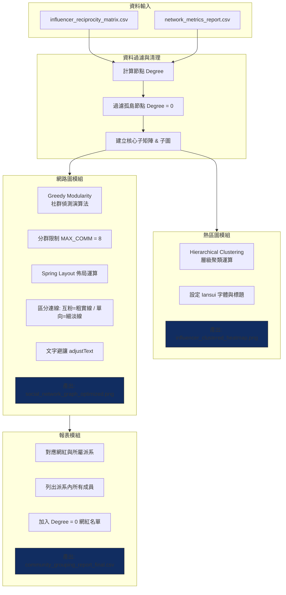

```mermaid
graph TD
    subgraph Input_Data [資料輸入]
        R[influencer_reciprocity_matrix.csv]
        M[network_metrics_report.csv]
    end

    subgraph Data_Filtering [資料過濾與清理]
        F1[計算節點 Degree]
        F2[過濾孤島節點 Degree = 0]
        F3[建立核心子矩陣 & 子圖]
    end

    subgraph Heatmap_Module [熱區圖模組]
        H1[Hierarchical Clustering<br/>層級聚類運算]
        H2[設定 Iansui 字體與標題]
        H3[產出: influencer_clustered_heatmap.png]
    end

    subgraph Network_Module [網路圖模組]
        N1[Greedy Modularity<br/>社群偵測演算法]
        N2[分群限制 MAX_COMM = 8]
        N3[Spring Layout 佈局運算]
        N4[區分連線: 互粉=粗實線 / 單向=細淡線]
        N5[文字避讓 adjustText]
        N6[產出: social_network_graph_optimized.png]
    end

    subgraph Report_Module [報表模組]
        C1[對應網紅與所屬派系]
        C2[列出派系內所有成員]
        C3[加入 Degree = 0 網紅名單]
        C4[產出: community_grouping_report_final.csv]
    end

    R & M --> F1 --> F2 --> F3
    F3 --> Heatmap_Module
    F3 --> Network_Module
    Network_Module --> Report_Module

    style H3 fill:#112d61,stroke:#333
    style N6 fill:#112d61,stroke:#333
    style C4 fill:#112d61,stroke:#333
```